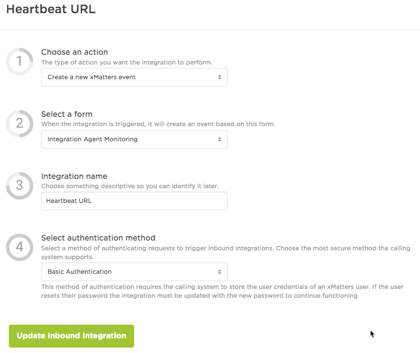
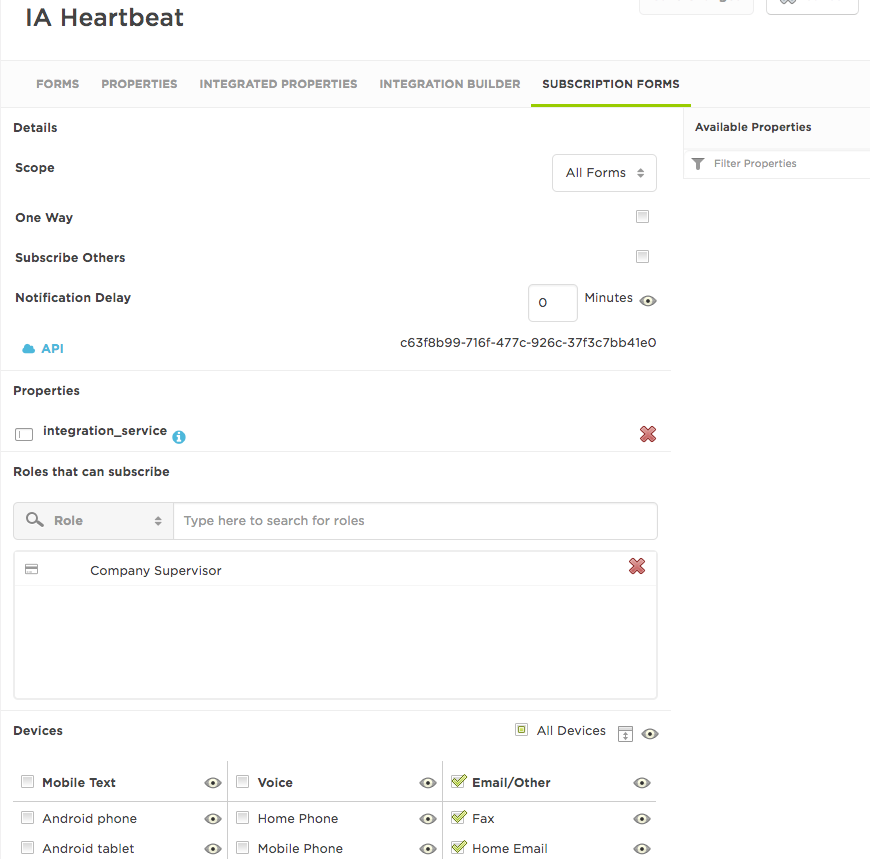

# IA-Heartbeat
Integration Service that routinely sends in an event, a related subscription ensures alerts are sent if the integration is non responsive for a time

This integration was originally created by our amazing xMatters Consultant, Matt Henry, after the idea came to him in a dream.

<kbd>
  
</kbd>

# Installation

## xMatters Configuration
* Create an API user giving it `REST Web Service role`.  Remember the username and password for later.
* Upload the communication plan `IntegrationAgentMonitoring.zip`
* Within the communication plan
  * Add the API user to the sender permissions list on the `Integration Agent Monitoring` form
  * Create an inbound integration that will create a new event on the Integration Agent Monitoring form
    * Make sure you select Basic Authentication

  * Save the integration and keep the trigger URL for later
  * Still in the communication plan, create a subscription form. Make sure:
    * You name the form appropriately
    * You keep the notification delay on the form
    * You add the `integration_service` property to the form
    * You assign a role (probably `Company Supervisor`) to the list of roles that can subscribe

  * Create a new group with no one in it to be the target of the notifications.  Remember the group name for later.
    * If you don't want anyone to see the group set the API User as a supervisor and remove all the observers.

## Integration Agent Configuration
* Merge this `integrationservices` into your `integrationservices` directory on the IA
* Edit `conf/IAConfig.xml` and include `<path>heartbeat-poller-engine/polling-engine.xml</path>` in the `service-configs` section
* Change the stored password for the API user:
  * Remove file `integrationservices/heartbeat-poller-engine/.initiatorpasswd`
  * Recreate the file on the command line with this command, replacing PASSWORD with the password you set for the API user above

`./bin/iapassword.sh --new PASSWORD --file integrationservices/heartbeat-poller-engine/.initiatorpasswd`

* Edit `integrationservices/heartbeat-poller-engine/configuration.js` and change the settings there.  Pay particular attention to:
  * `WEB_SERVICE_URL` - Must be the full URL from the inbound integration above.
  * `BASE_URL` - Must be the host name of your instance including the https://
  * `POLLING_INTERVAL_MS` - Decide on how often you want to send in a heartbeat.  Enter that here in milliseconds.
  * `INTEGRATION_SERVICE_FIELD_VALUE` - This is the unique identifier for this agent's heartbeat.
    Try keeping "IA Monitoring" in the value (for easy subscription matching) but also include the name of the server the agent is on or some other identifier for this agent.  I've used "Agent 1 IA Monitoring".
  * `INTEGRATION_TARGET` - Enter the name of the group you created above.
  * `API_USER` - Enter the user ID of the API user you created above.
* Restart the integration agent.

## Create a subscription
In xMatters create a subscription using the subscription form you have created.
* Make sure you set a notification delay that is longer than the poll interval `POLLING_INTERVAL_MS` defined for the integration on the agent above.
* Enter text in the integration_service property that is in all the agent messages you want to keep tabs on.  For instance if you've several agents using different but similar values like, "Agent 1 IA Monitoring", "Agent 2 IA Monitoring" and "Agent 3 IA Monitoring" you can keep an eye on them all with one subscription that looks for "IA Monitoring".

# Testing
* Let the integration agent run for a few poll intervals.  Note the events created in the reports tab.  Note that each time a new event comes in the old events are terminated.
* Stop the integration agent.  After the subscription delay you will receive a notification from xMatters On Demand.

# Troubleshooting
* If you have a particularly busy environment you may find that the event deletions are not processed quickly enough as they can get queued behind other events.  Try extending the time the subscription waits for to give the integration more time to catch the events before they notify you.
